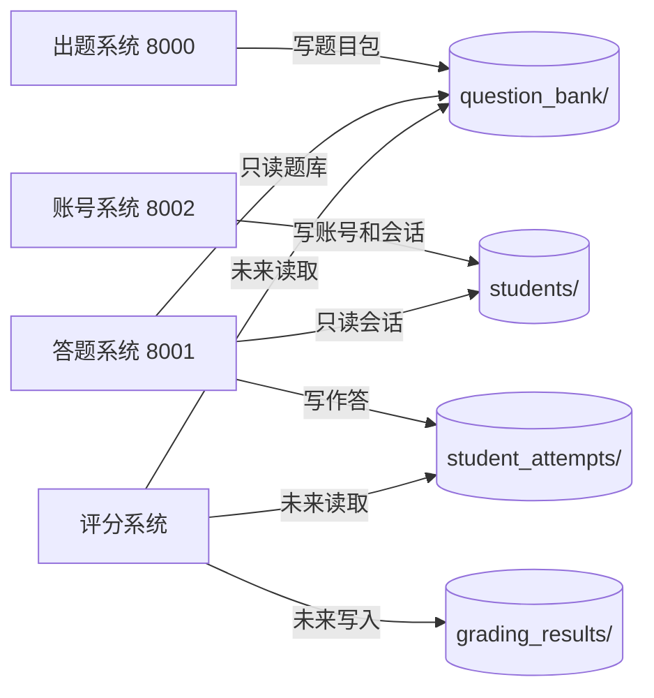
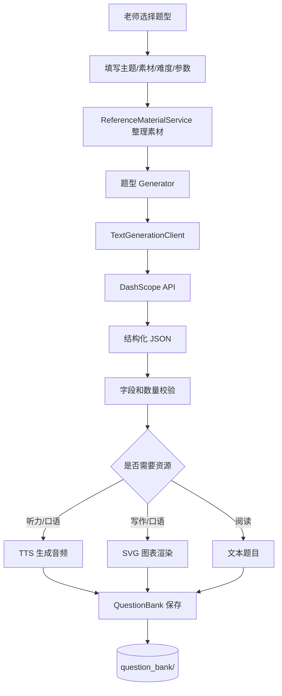

# TestDaF 本地模拟考试系统

这是一个本地优先的 TestDaF 题库生成、学生登录、在线答题和后续评分平台。系统以文件目录和 JSON 作为边界，适合单机开发、线下演示、LLM 辅助迭代和后续拆分为多个服务。

当前仓库已经从早期的单一出题应用演进为四个相互解耦的本地系统：

- **出题系统**：老师生成听力、阅读、写作、口语题目包，写入 `question_bank/`。
- **学生账号系统**：学生注册、登录、查看个人中心，写入 `students/`。
- **学生答题系统**：学生进行单项练习和整卷模考，写入 `student_attempts/`。
- **评分系统**：当前保留边界说明，未来读取题库和作答记录，写入评分结果。

更细的架构说明见 [docs/architecture-overview.md](docs/architecture-overview.md)。

## 快速启动

首次使用先同步依赖：

```bash
uv sync
```

分别启动需要的系统：

| 系统 | 命令 | 地址 |
| --- | --- | --- |
| 出题系统 | `uv run python main.py` | `http://127.0.0.1:8000/` |
| 学生答题系统 | `uv run python student_main.py` | `http://127.0.0.1:8001/` |
| 学生账号系统 | `uv run python student_account_platform/account_main.py` | `http://127.0.0.1:8002/` |

macOS / Windows 也可以使用根目录脚本：

```text
start_mac.command
start_windows.bat
```

## 推荐使用流程

1. 老师进入 `8000` 出题系统，生成听力、阅读、写作、口语题目。
2. 题目包保存到 `question_bank/`，每个题目目录包含 `manifest.json` 和预览/资源文件。
3. 学生进入 `8002` 注册或登录，账号和会话写入 `students/`。
4. 学生进入 `8001` 进行单项练习或整卷模考。
5. 学生作答保存到 `student_attempts/`，后续评分系统基于该目录读取结果。

## 系统边界



系统之间不通过内部 Web API 互相调用，核心通信边界是本地目录：

- `question_bank/`：出题系统写，学生系统和评分系统读。
- `students/`：账号系统写，学生系统只读会话。
- `student_attempts/`：学生系统写，评分系统未来读。
- `grading_results/`：评分系统未来写。

## 功能状态

| 模块 | 当前状态 |
| --- | --- |
| 出题系统 | 已支持 TestDaF 听力、阅读、写作、口语主要题型生成 |
| 学生账号系统 | 已支持注册、登录、会话、个人中心和学生名单 |
| 单项练习 | 已支持听力、阅读、写作、口语在线作答 |
| 整卷模考 | 已支持阅读 → 听力 → 写作 → 口语模块化考试 |
| 作答保存 | 已保存学生身份、题目元信息、答案 JSON、口语录音文件 |
| 评分系统 | 当前为边界占位，等待作答协议继续稳定 |

## 出题系统能力

| 模块 | 题型 | 主要产物 |
| --- | --- | --- |
| 听力 | Aufgabe 1 | 双人校园对话、8 道短答题、分段 TTS、完整音频 |
| 听力 | Aufgabe 2 | 主持人与两位嘉宾访谈、10 道 Richtig/Falsch、完整音频 |
| 听力 | Aufgabe 3 | 专家访谈、7 道短答题、完整音频 |
| 阅读 | Aufgabe 1 | A-H 短文本、10 个人物需求、匹配答案 |
| 阅读 | Aufgabe 2 | 中长阅读文本、10 道 A/B/C 单选题 |
| 阅读 | Aufgabe 3 | 长阅读文本、10 道 Ja/Nein/Text sagt dazu nichts |
| 写作 | Aufgabe 1 | 写作题干、任务要求、SVG 图表 |
| 口语 | Aufgabe 1-7 | 口语任务、考官引导语音、可选图表 |
| 口语 | Test Set | 7 题套卷 |

出题主链路：



## 学生账号系统

账号系统位于 `student_account_platform/`，负责 `students/` 的写入：

- `students/accounts.json`：学生账号信息。
- `students/sessions/*.json`：登录会话。
- Cookie 名称：`student_session`。
- 默认会话有效期：7 天。

答题系统不会写账号数据，只通过会话 token 只读解析当前学生身份。

## 学生答题系统

学生答题系统位于 `student_platform/`，核心能力包括：

- 首页按模块展示题库。
- 单项练习支持听力、阅读、写作、口语。
- 整卷模考从题库中按模块组卷。
- 考试记录页面列出历史整卷。
- 作答记录页面列出历史 attempt。
- 口语录音通过浏览器 `MediaRecorder` 采集并保存为音频文件。

整卷模考模块顺序固定：

```text
reading -> listening -> writing -> speaking
```

## 口语答题规则

单项练习和整卷模考的口语题均使用同一套阶段化流程：

```text
题目锁定 -> 点击开始本题 -> 准备倒计时 -> 播放引导语 -> 录音倒计时 -> 试听 -> 提交
```

关键规则：

- 进入页面时题面模糊，学生必须点击 `开始本题` 才能查看题目。
- 点击开始后，题目显示并进入准备倒计时。
- 准备结束后播放考官引导语，音频结束后进入录音。
- 录音结束后可试听并提交。
- 点击开始后刷新页面，会立即提交空答案。
- 空答案记录为 `spoken: ""` 和 `status: "unanswered_due_to_refresh"`。
- 单项练习刷新后进入作答结果页。
- 整卷模考刷新后进入下一道口语题；最后一题刷新后提交口语模块。

该规则用于防止学生在口语题已经开始后通过刷新重置准备时间或录音阶段。

## 作答保存协议

每次学生提交都会在 `student_attempts/` 下生成一个目录：

```text
student_attempts/
  attempt_YYYYMMDD_HHMMSS_xxxxxxxx/
    meta.json
    answers.json
    response.webm      # 口语题存在录音时生成
```

`meta.json` 保存：

- `attempt_id`
- `question_id`
- `section`
- `task_type`
- `answer_mode`
- `title`
- `submitted_at`
- `time_limit_seconds`
- `elapsed_seconds`
- `timed_out`
- `student_id`
- `student_name`
- `exam_id`：整卷模考作答时存在。
- `audio_file`：口语录音存在时存在。

`answers.json` 保存具体答案。客观题、写作题和口语题使用不同结构；口语正常提交使用 `spoken: "recorded"`，刷新空提交使用 `spoken: ""`。

## 题库文件结构

题库根目录：

```text
question_bank/
  listening/
  reading/
  writing/
  speaking/
```

每个题目包通常包含：

```text
manifest.json
preview.md
reference_sources.json
audio.wav
chart_*.svg
```

实际文件取决于题型。例如听力和口语包含音频，写作和部分口语包含图表。

## 仓库结构

```text
testdaf_platform/             # 出题系统
student_account_platform/     # 学生账号系统
student_platform/             # 学生答题系统
scoring_platform/             # 评分系统边界说明
shared/                       # 原子 JSON、路径保护等共享工具
docs/                         # 架构说明和路线图
scripts/                      # 诊断、对比、验证脚本
tests/                        # 单元和回归测试
question_bank/                # 本地生成题库，通常不提交
student_attempts/             # 学生作答数据，通常不提交
students/                     # 学生账号和会话数据，通常不提交
tmp/                          # 临时实验输出，通常不提交
```

## API Key 和模型配置

可以在出题系统页面表单中填写阿里云百炼 API Key，也可以设置环境变量：

```bash
export DASHSCOPE_API_KEY=YOUR_API_KEY
```

主要模型配置在 `testdaf_platform/config.py`：

```python
QWEN_TEXT_MODEL = "qwen3.7-plus"
QWEN_TTS_MODEL = "qwen3-tts-flash"
```

文本生成统一走 `TextGenerationClient`。`qwen3.7-plus` 自动使用 DashScope `multimodal-generation` 兼容路径。

## TTS 指令

听力生成支持集中式 TTS 指令：

- 指令辅助逻辑位于 `testdaf_platform/usecases/_instruction_support.py`。
- 指令模板位于 `testdaf_platform/services/tts_instructions.py`。
- 对比脚本位于 `scripts/compare_tts_instructions.py`。

常用验证：

```bash
uv run python scripts/compare_tts_instructions.py
```

生成的对比音频和报告建议放在 `tmp/`，不要提交。

## 常用验证

```bash
uv run python -m compileall testdaf_platform student_platform student_account_platform shared tests scripts
uv run python -m unittest discover -s tests -v
uv run python scripts/check_dashscope_model.py --model qwen3.7-plus --compare qwen-plus
uv run python scripts/verify_attempt_answer_trace.py
```

如果本地没有安装 `pytest`，使用 `unittest` 和 `compileall` 作为基础验证即可。

## 开发约束

- 出题系统是 `question_bank/` 的唯一写者。
- 账号系统是 `students/` 的唯一写者。
- 学生答题系统只读 `question_bank/` 和 `students/sessions/`。
- 学生答题系统写 `student_attempts/`。
- 评分系统未来只读 `question_bank/` 和 `student_attempts/`，写 `grading_results/`。
- 学生系统不要 import 出题生成器。
- 评分系统不要调用出题或学生 Web 路由。
- 共享文件读写能力放在 `shared/`。
- 新增 JSON 写入必须使用原子写策略。
- 不要提交 `question_bank/`、`student_attempts/`、`students/`、`tmp/` 中的本地运行数据，除非明确需要构造测试 fixture。

## 当前重点

- 出题链路继续稳定生成质量。
- 学生端继续补齐更细的作答回放和检查能力。
- 评分系统等待作答协议进一步稳定后实现。
- 口语题的防刷新规则已经在单项练习和整卷模考中统一。
